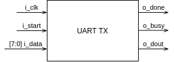
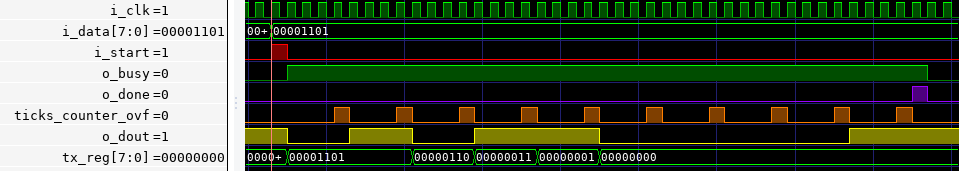
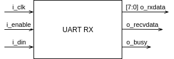
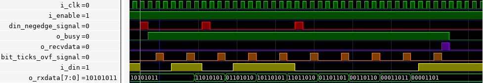

# Basic UART TX/RX module for FPGA

A simple UART TX/RX module implemented using Verilog HDL for FPGA

## How it works

The UART TX/RX module is internally projected to work with any baud rate of user choice.
That has to be done through module instantiation parameters: 

```
TICKS_PER_BIT       : Number of clock ticks for a bit time (ticks per bit = system clock / baud rate)
TICKS_PER_BIT_SIZE  : Number of bits to hold TICKS_PER_BIT value, usually obtained using $bits(TICKS_PER_BIT);
```

Note that the baud rate can't be ajusted on-the-fly, it just can be done in compilation / synthesis time.

Those modules is simple designed, no complexity such as parity bit or two stop bits is implemented.

### UART TX module



Module inputs:
```
i_clk        : System clock
i_start      : Start pulse
[7:0] i_data : Data to be send
```

Module outputs:
```
o_done       : Done pulse output
o_busy       : Busy signal output
o_dout       : Data out (TX) output
```

Module Waveform:




### UART RX module



Module inputs:
```
i_clk       : System clock
i_enable    : RX enable signal
i_din       : Data in (RX)
```

Module outputs:
```
[7:0] o_rxdata  : Data received
o_recvdata      : Data received pulse
o_busy          : Busy signal output
```

Module Waveform:



## Prerequisites

Any Verilog compiler tool and a logic waveform analyzer, for instance: GTK Wave.

A FPGA (optional).

## Compile and test

1. Compile the source code using Icarus Verilog:

```
iverilog -o uart_tb.out uart_tb.v
```

2. Executing the compiled file (run the tests):

```
vvp uart_tb.out
```

3. Opeing the waveform analyzer:

```
gtkwave uart_tb.vcd
```

## Explaining the testbench

The testbench script perform a series of stimulus on UART RX/TX modules, and those can be analyzed to check if the module behaviour is working as expected.

The module was tested successfully on Altera Cyclone II and works fine using a such low resources from FPGA.

## Versioning

    17/10/2018 - Initial work (V1.0)

## Authors

* **Matheus Alencar Nascimento** - *Initial work*

## License

This project is licensed under the MIT License - see the [LICENSE] file for details

## Acknowledgments

* NandLand [Website](https://www.nandland.com/)
